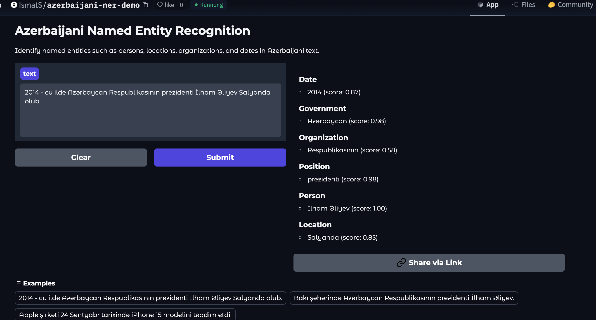
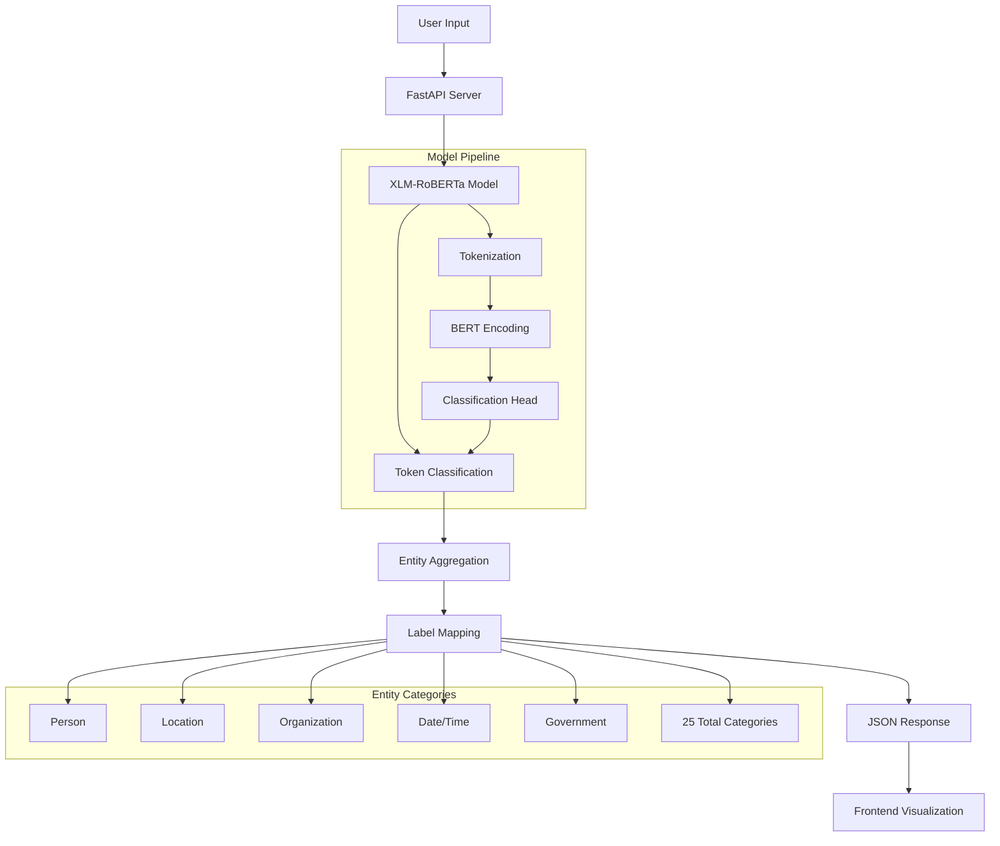
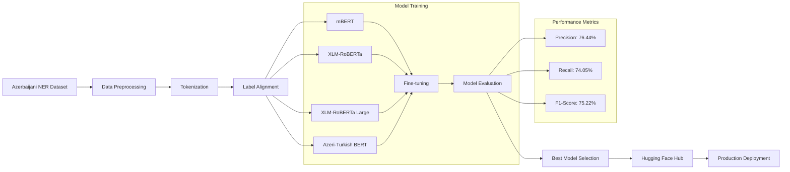
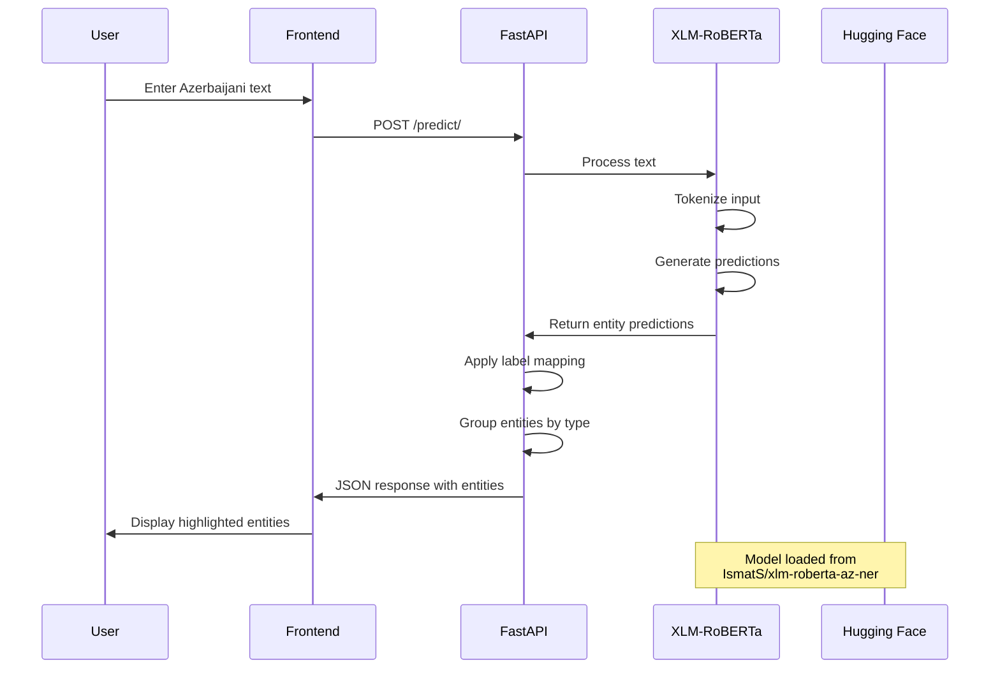
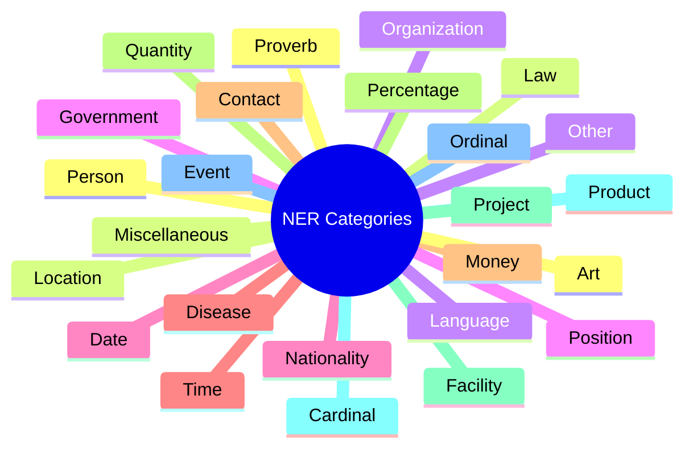
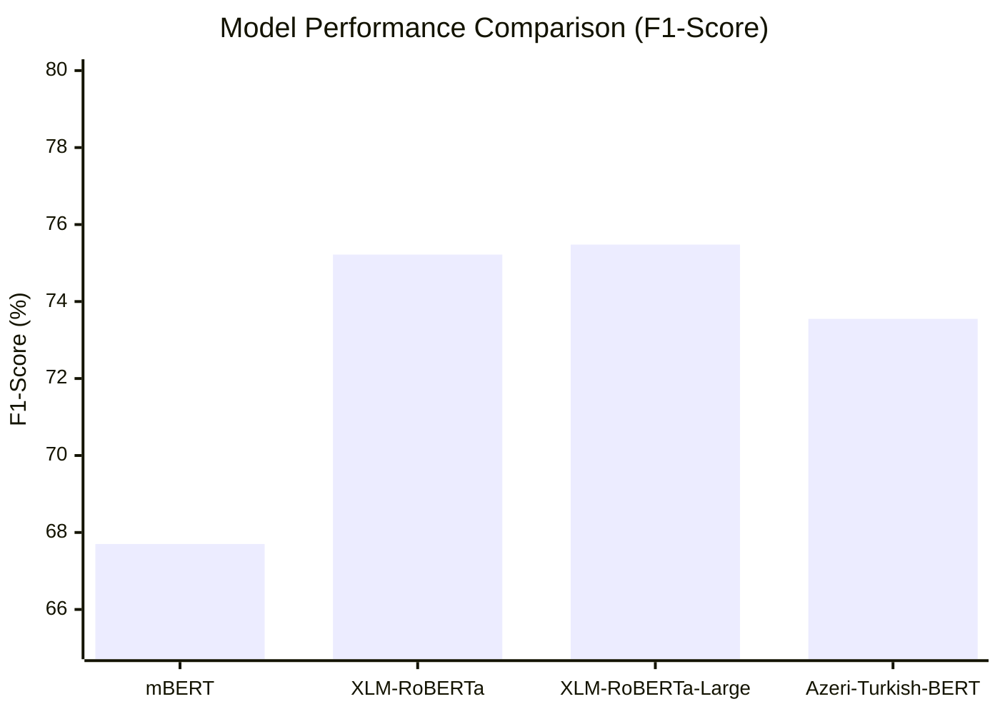
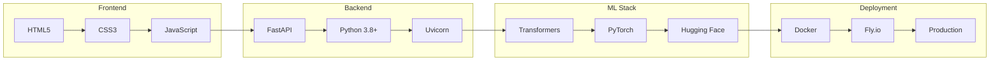

# 🔍 Named Entity Recognition for Azerbaijani Language

A state-of-the-art Named Entity Recognition (NER) system specifically designed for the Azerbaijani language, featuring multiple fine-tuned transformer models and a production-ready FastAPI deployment with an intuitive web interface.

## 📸 Preview



## 🚀 Live Demo

Try the live demo: [Named Entity Recognition Demo](https://named-entity-recognition.fly.dev/)

**Note:** The server runs on a free tier and may take 1-2 minutes to initialize if inactive. Please be patient during startup.

## 🏗️ System Architecture



## 🤖 Model Training Pipeline



## 🔄 Data Flow Architecture



## Project Structure

```
.
├── Dockerfile                # Docker image configuration
├── README.md                # Project documentation
├── fly.toml                 # Fly.io deployment configuration
├── main.py                  # FastAPI application entry point
├── models/                  # Model-related files
│   ├── NER_from_scratch.ipynb    # Custom NER implementation notebook
│   ├── README.md                 # Models documentation
│   ├── XLM-RoBERTa.ipynb        # XLM-RoBERTa training notebook
│   ├── azeri-turkish-bert-ner.ipynb  # Azeri-Turkish BERT training
│   ├── mBERT.ipynb              # mBERT training notebook
│   ├── push_to_HF.py            # Hugging Face upload script
│   ├── train-00000-of-00001.parquet  # Training data
│   └── xlm_roberta_large.ipynb  # XLM-RoBERTa Large training
├── requirements.txt         # Python dependencies
├── static/                  # Frontend assets
│   ├── app.js               # Frontend logic
│   └── style.css            # UI styling
└── templates/               # HTML templates
    └── index.html           # Main UI template
```

## 🧠 Models & Dataset

### 🏆 Available Models

| Model | Parameters | F1-Score | Hugging Face | Status |
|-------|------------|----------|--------------|---------|
| [mBERT Azerbaijani NER](https://huggingface.co/IsmatS/mbert-az-ner) | 180M | 67.70% | ✅ | Released |
| [XLM-RoBERTa Azerbaijani NER](https://huggingface.co/IsmatS/xlm-roberta-az-ner) | 125M | **75.22%** | ✅ | **Production** |
| [XLM-RoBERTa Large Azerbaijani NER](https://huggingface.co/IsmatS/xlm_roberta_large_az_ner) | 355M | 75.48% | ✅ | Released |
| [Azerbaijani-Turkish BERT Base NER](https://huggingface.co/IsmatS/azeri-turkish-bert-ner) | 110M | 73.55% | ✅ | Released |

### 📊 Supported Entity Types (25 Categories)



### 📈 Dataset Information
- **Source:** [Azerbaijani NER Dataset](https://huggingface.co/datasets/LocalDoc/azerbaijani-ner-dataset)
- **Size:** High-quality annotated Azerbaijani text corpus
- **Language:** Azerbaijani (az)
- **Annotation:** IOB2 format with 25 entity categories
- **Training Infrastructure:** A100 GPU on Google Colab Pro+

## 📊 Model Performance Comparison



## 📈 Detailed Performance Metrics

### mBERT Performance

| Epoch | Training Loss | Validation Loss | Precision | Recall | F1 | Accuracy |
|-------|---------------|-----------------|-----------|---------|-------|-----------|
| 1 | 0.2952 | 0.2657 | 0.7154 | 0.6229 | 0.6659 | 0.9191 |
| 2 | 0.2486 | 0.2521 | 0.7210 | 0.6380 | 0.6770 | 0.9214 |
| 3 | 0.2068 | 0.2534 | 0.7049 | 0.6507 | 0.6767 | 0.9209 |

### XLM-RoBERTa Base Performance

| Epoch | Training Loss | Validation Loss | Precision | Recall | F1 |
|-------|---------------|-----------------|-----------|---------|-------|
| 1 | 0.3231 | 0.2755 | 0.7758 | 0.6949 | 0.7331 |
| 3 | 0.2486 | 0.2525 | 0.7515 | 0.7412 | 0.7463 |
| 5 | 0.2238 | 0.2522 | 0.7644 | 0.7405 | 0.7522 |
| 7 | 0.2097 | 0.2507 | 0.7607 | 0.7394 | 0.7499 |

### XLM-RoBERTa Large Performance

| Epoch | Training Loss | Validation Loss | Precision | Recall | F1 |
|-------|---------------|-----------------|-----------|---------|-------|
| 1 | 0.4075 | 0.2538 | 0.7689 | 0.7214 | 0.7444 |
| 3 | 0.2144 | 0.2488 | 0.7509 | 0.7489 | 0.7499 |
| 6 | 0.1526 | 0.2881 | 0.7831 | 0.7284 | 0.7548 |
| 9 | 0.1194 | 0.3316 | 0.7393 | 0.7495 | 0.7444 |

### Azeri-Turkish-BERT Performance

| Epoch | Training Loss | Validation Loss | Precision | Recall | F1 |
|-------|---------------|-----------------|-----------|---------|-------|
| 1 | 0.4331 | 0.3067 | 0.7390 | 0.6933 | 0.7154 |
| 3 | 0.2506 | 0.2751 | 0.7583 | 0.7094 | 0.7330 |
| 6 | 0.1992 | 0.2861 | 0.7551 | 0.7170 | 0.7355 |
| 9 | 0.1717 | 0.3138 | 0.7431 | 0.7255 | 0.7342 |

## ⚡ Key Features

- 🎯 **State-of-the-art Accuracy**: 75.22% F1-score on Azerbaijani NER
- 🌐 **25 Entity Categories**: Comprehensive coverage including Person, Location, Organization, Government, and more
- 🚀 **Production Ready**: Deployed on Fly.io with FastAPI backend
- 🎨 **Interactive UI**: Real-time entity highlighting with confidence scores
- 🔄 **Multiple Models**: Four different transformer models to choose from
- 📊 **Confidence Scoring**: Each prediction includes confidence metrics
- 🌍 **Multilingual Foundation**: Built on XLM-RoBERTa for cross-lingual understanding
- 📱 **Responsive Design**: Works seamlessly across desktop and mobile devices

## 🛠️ Technology Stack



## 🚀 Setup Instructions

### Local Development

1. **Clone the repository**
```bash
git clone https://github.com/Ismat-Samadov/Named_Entity_Recognition.git
cd Named_Entity_Recognition
```

2. **Set up Python environment**
```bash
# Create virtual environment
python -m venv .venv

# Activate virtual environment
# On Unix/macOS:
source .venv/bin/activate
# On Windows:
.venv\Scripts\activate

# Install dependencies
pip install -r requirements.txt
```

3. **Run the application**
```bash
uvicorn main:app --host 0.0.0.0 --port 8080
```

### Fly.io Deployment

1. **Install Fly CLI**
```bash
# On Unix/macOS
curl -L https://fly.io/install.sh | sh
```

2. **Configure deployment**
```bash
# Login to Fly.io
fly auth login

# Initialize app
fly launch

# Configure memory (minimum 2GB recommended)
fly scale memory 2048
```

3. **Deploy application**
```bash
fly deploy

# Monitor deployment
fly logs
```

## 💡 Usage

### Quick Start
1. **Access the application:**
   - 🏠 Local: http://localhost:8080
   - 🌐 Production: https://named-entity-recognition.fly.dev

2. **Enter Azerbaijani text** in the input field
3. **Click "Submit"** to process and view named entities
4. **View results** with entities highlighted by category and confidence scores

### Example Usage

```python
# Example API request
import requests

response = requests.post(
    "https://named-entity-recognition.fly.dev/predict/",
    data={"text": "2014-cü ildə Azərbaycan Respublikasının prezidenti İlham Əliyev Salyanda olub."}
)

print(response.json())
# Output: {
#   "entities": {
#     "Date": ["2014"],
#     "Government": ["Azərbaycan"],
#     "Organization": ["Respublikasının"],
#     "Position": ["prezidenti"],
#     "Person": ["İlham Əliyev"],
#     "Location": ["Salyanda"]
#   }
# }
```

## 🎯 Model Capabilities

- **Person Names**: İlham Əliyev, Heydər Əliyev, Nizami Gəncəvi
- **Locations**: Bakı, Salyanda, Azərbaycan, Gəncə
- **Organizations**: Respublika, Universitet, Şirkət
- **Dates & Times**: 2014-cü il, sentyabr ayı, səhər saatları
- **Government Entities**: prezident, nazir, məclis
- **And 20+ more categories...**

## 🤝 Contributing

We welcome contributions! Here's how you can help:

1. 🍴 Fork the repository
2. 🌿 Create your feature branch (`git checkout -b feature/AmazingFeature`)
3. 💍 Commit your changes (`git commit -m 'Add some AmazingFeature'`)
4. 📤 Push to the branch (`git push origin feature/AmazingFeature`)
5. 🔀 Open a Pull Request

### Development Areas
- 🧠 Model improvements and fine-tuning
- 🎨 UI/UX enhancements
- 📊 Performance optimizations
- 🧪 Additional test cases
- 📖 Documentation improvements

## 📄 License

This project is open source and available under the [MIT License](LICENSE).

## 🙏 Acknowledgments

- Hugging Face team for the transformer models and infrastructure
- Google Colab for providing A100 GPU access
- Fly.io for hosting the production deployment
- The Azerbaijani NLP community for dataset contributions


## 📊 Repository Stats


## 🔗 Related Projects

- [Azerbaijani NER Dataset](https://huggingface.co/datasets/LocalDoc/azerbaijani-ner-dataset)
- [mBERT Azerbaijani NER Model](https://huggingface.co/IsmatS/mbert-az-ner)
- [XLM-RoBERTa Azerbaijani NER Model](https://huggingface.co/IsmatS/xlm-roberta-az-ner)